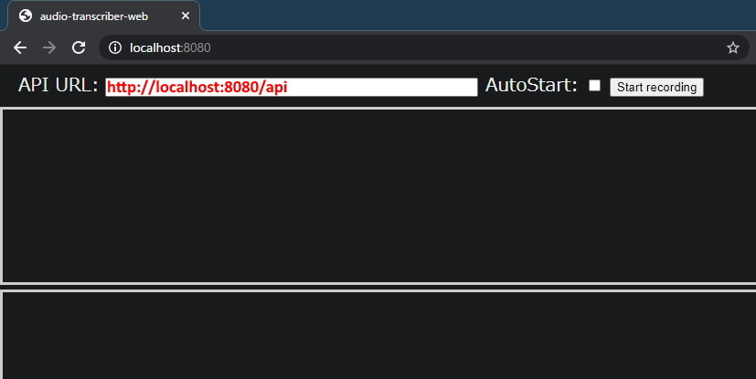

# audio-transcriber-web

[Click here for English README](README.md)

ブラウザを用いてマイクからの音声を`SpeechRecognition`を使って自動的に書き起こし、ファイルに書き込む。

- [GitHub Pages](https://book000.github.io/audio-transcriber-web/static/index.html)
- 動画・音声ファイルからの文字起こしは[book000/audio-transcriber-docker](https://github.com/book000/audio-transcriber-docker)

## Warning / Disclaimer

**このプロジェクトを使用したことによって引き起こされた問題に関して開発者は一切の責任を負いません。**

というか、それなりに真面目なことに使うのであれば[Google Cloud PlatformのSpeech-to-Text](https://cloud.google.com/speech-to-text)とかを使いましょう。  
一切のサポートはしません。

## Feature

- `API URL`を入力することで、指定したアドレスに書き起こしたテキストを自動的に送信します。
- `AutoStart`機能をオンにすることで、ページにアクセスした時やリロードした瞬間から録音を開始します。(beta)
- `API URL`と`AutoStart`の設定内容は[localStorage](https://developer.mozilla.org/ja/docs/Web/API/Window/localStorage)に保存し、保持します。

## Requirements

- Chrome 33+ / Edge 79+ ([Can I use SpeechRecognition?](https://caniuse.com/mdn-api_speechrecognition))
- Python 3.6+
- `requirements.txt`: fastapi, uvicorn

## Installation & Usage

### 1. Git Clone

`git clone https://github.com/book000/audio-transcriber-web.git`

### 2. Install packages from `requirements.txt`

`pip3 install -r -U requirements.txt`

### 3. Run `main.py --open-browser`

`python3 main.py --open-browser`

### 4. Type `http://localhost:8080/api` in the `API URL` form

### 5. Click the `Start recording`

`AutoStart`をオンにしておくとページにアクセスした瞬間から録音開始します。

## Notes

- `api.php`をどこかのサーバにおいてそこへのアドレスを`API URL`に設定して動作させることもできる。

## ライセンス / License

このプロジェクトのライセンスは[MIT License](https://github.com/book000/audio-transcriber-web/blob/master/LICENSE)です。
