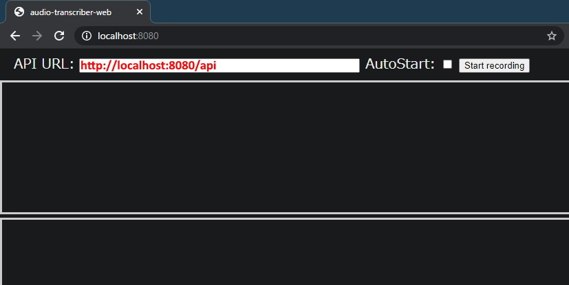

# audio-transcriber-web

[日本語のREADMEはこちらから](README-ja.md)

Using `SpeechRecognition` of browser, audio from the microphone automatically transcribe and written to file.

- [GitHub Pages](https://book000.github.io/audio-transcriber-web/static/index.html)
- For transcriptions from video and audio files: [book000/audio-transcriber-docker](https://github.com/book000/audio-transcriber-docker)

## Warning / Disclaimer

**The author is not responsible for any problems caused by the user using this project.**

Or rather, if you want to use it seriously, use [Google Cloud Platform Speech-to-Text](https://cloud.google.com/speech-to-text).  
We do not provide any support.

## Feature

- Input the `API URL`, can send the transcribed text to the specified address automatically.
- With the `AutoStart` feature turned on, recording will start the moment you visit the page or reload. (beta)
- The `API URL` and `AutoStart` settings are stored and maintained in [localStorage](https://developer.mozilla.org/en/docs/Web/API/Window/localStorage).
- Shows alternatives to recognize sentences and diffs by hovering the results.

## Requirements

- Chrome 33+ / Edge 79+ ([Can I use SpeechRecognition?](https://caniuse.com/mdn-api_speechrecognition))
- Python 3.6+
- `requirements.txt`: fastapi, uvicorn

## Installation & Usage

### 1. Git Clone

`git clone https://github.com/book000/audio-transcriber-web.git`

### 2. Install packages from `requirements.txt`

`pip3 install -U -r requirements.txt`

### 3. Run `main.py --open-browser`

`python3 main.py --open-browser`

### 4. Type `http://localhost:8080/api` in the `API URL` form

### 5. Click the `Start recording`

If you turn on `AutoStart`, recording will start the moment you access the page.

## Notes

- It also works if you put `api.php` on a server somewhere and set the address to it to an `API URL`.

## License

The license for this project is [MIT License](https://github.com/book000/audio-transcriber-web/blob/master/LICENSE).

This project contains several libraries. The library licenses are as follows.

- [axios](https://github.com/axios/axios) MIT License, Copyright (c) 2014-present Matt Zabriskie
- [jsdifflib](https://github.com/cemerick/jsdifflib) BSD license, 2007 - 2011 Chas Emerick
